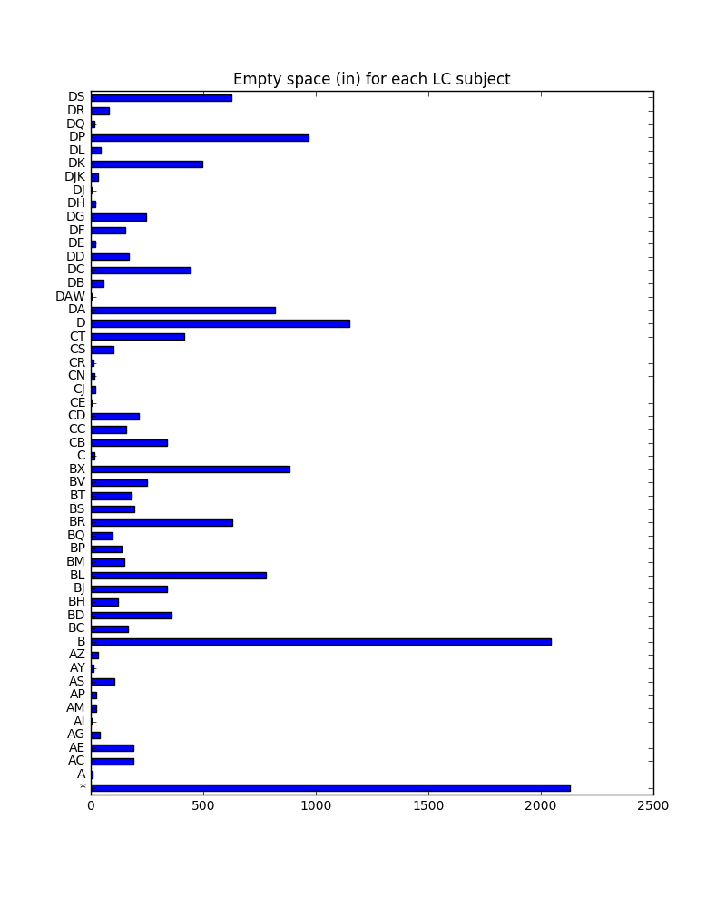
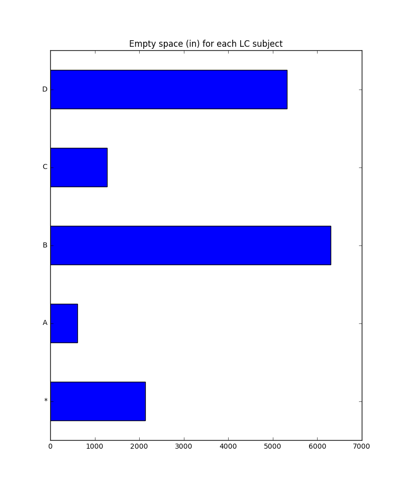

# UNM College of University Libraries and Learning Sciences Shelf Space Analysis

This is where some intro text will go ...

## Summary information for LC subject prefixes

Total Capacity (in): 144786.75\
Total Occupied (in): 129149.0\
Total Empty Space (in): 15637.75\
Total Empty Space (pct): 10.800539414\

## Summary information for LC subjects

Total Capacity (in): 145532.25\
Total Occupied (in): 129815.5\
Total Empty Space (in): 15716.75\
Total Empty Space (pct): 10.7994963316\

## Summary Tables

      Occupied (in)    Capacity (in)    Empty (in)    Empty (pct)
--  ---------------  ---------------  ------------  -------------
*                 0          2130          2130         100
A              4220          4828           608          12.5932
B             57100         63403          6303           9.94117
C              8464          9744.75       1280.75       13.143
D             59365         64681          5316           8.2188

Table: LC Prefix Space Summary Table

       Occupied (in)    Capacity (in)    Empty (in)    Empty (pct)
---  ---------------  ---------------  ------------  -------------
*                0            2130          2130         100
A               45              53.25          8.25       15.493
AC            1214.5          1402.25        187.75       13.3892
AE            1231            1420           189          13.3099
AG             331.5           372.75         41.25       11.0664
AI              49.5            53.25          3.75        7.04225
AM             366             390.5          24.5         6.27401
AP             207.5           230.75         23.25       10.0758
AS             621             727.75        106.75       14.6685
AY              78.5            88.75         10.25       11.5493
AZ             180             213            33          15.493
B            13594.5         15637.8        2043.25       13.0661
BC             776             940.75        164.75       17.5126
BD            2322.5          2680.25        357.75       13.3476
BH             750             869.75        119.75       13.7683
BJ            2166            2502.75        336.75       13.4552
BL            6730            7508.25        778.25       10.3653
BM            2034.5          2183.25        148.75        6.81324
BP            1585            1721.75        136.75        7.9425
BQ            1073            1171.5          98.5         8.40802
BR            5478            6106           628          10.285
BS            4828            5023.25        195.25        3.88693
BT            3012            3195           183           5.7277
BV            2500            2751.25        251.25        9.13221
BX           10405           11289           884           7.83063
C               36              53.25         17.25       32.3944
CB            2039            2378.5         339.5        14.2737
CC            1207.5          1366.75        159.25       11.6517
CD            1330            1544.25        214.25       13.874
CE              51              53.25          2.25        4.22535
CJ             175             195.25         20.25       10.3713
CN             106.5           124.25         17.75       14.2857
CR             217             230.75         13.75        5.95883
CS             699.5           798.75         99.25       12.4257
CT            2726            3141.75        415.75       13.2331
D            13744           14892.2        1148.25        7.71039
DA           10809           11626.2         817.25        7.02935
DAW             51              53.25          2.25        4.22535
DB            1027.5          1082.75         55.25        5.10275
DC            4652.5          5094.25        441.75        8.67154
DD            3400            3567.75        167.75        4.70184
DE             352             372.75         20.75        5.56673
DF            1531.5          1686.25        154.75        9.17717
DG            2861.5          3106.25        244.75        7.87928
DH             247.5           266.25         18.75        7.04225
DJ             121.5           124.25          2.75        2.21328
DJK            233             266.25         33.25       12.4883
DK            4562.5          5058.75        496.25        9.80974
DL             399             443.75         44.75       10.0845
DP            7748            8715.25        967.25       11.0984
DQ             144             159.75         15.75        9.85915
DR             932.5          1011.75         79.25        7.83296
DS            6832            7455           623           8.35681

Table: LC Subject Space Summary Table

